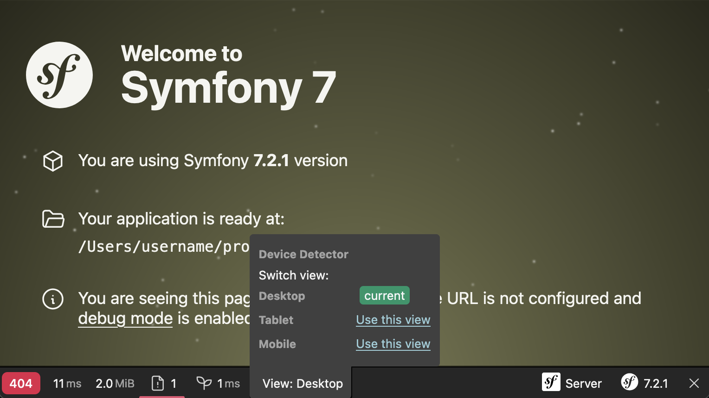

MobileDetectBundle
==================

Symfony 5.4.x-7.0 bundle to detect mobile devices, manage mobile view and redirect to the mobile and tablet version.

[](https://github.com/tattali/MobileDetectBundle/actions/workflows/main.yml?query=branch%3Amain) [](https://packagist.org/packages/tattali/mobile-detect-bundle) [](https://packagist.org/packages/tattali/mobile-detect-bundle) [](https://sonarcloud.io/summary/new_code?id=tattali_MobileDetectBundle) [](https://packagist.org/packages/tattali/mobile-detect-bundle) [](https://packagist.org/packages/tattali/mobile-detect-bundle)

*This bundle is a fork of [suncat2000/MobileDetectBundle](https://github.com/suncat2000/MobileDetectBundle). As this project doesn't look maintained anymore, we decided to create & maintain a fork. For more information read our [manifest](https://github.com/tattali/MobileDetectBundle/issues/8).*

Introduction
------------

This Bundle use [MobileDetect](https://github.com/serbanghita/Mobile-Detect) class and provides the following features:

* Detect the various mobile devices by Name, OS, browser User-Agent
* Manages site views for the various mobile devices (`mobile`, `tablet`, `desktop`)
* Redirects to mobile and tablet sites

* **[Migrate to 7x](src/Resources/doc/migration-7x.md)**

Documentation
-------------

### Installation
```sh
composer require tattali/mobile-detect-bundle
```
*Install with Symfony legacy versions: [here](src/Resources/doc/legacy-versions.md)*
### Usage

#### Checking device

```php
use Detection\MobileDetect;

public function someaction(MobileDetect $mobileDetector)
{
    $mobileDetector->isMobile();
    $mobileDetector->isTablet();
    $mobileDetector->is('iPhone');
}
```

With Twig
```twig


 # magic methods is[...]
```
Available User-Agents (uaMatch) with the php `is()` and twig `is_device()` [here](https://github.com/serbanghita/Mobile-Detect/blob/4.8.x/MobileDetect.json)

#### Switch device view

For switch device view, use `device_view` GET parameter:

```url
https://localhost:8000?device_view={desktop/mobile/tablet}
```

Or using the Symfony toolbar


#### Going further

- [Symfony legacy versions](src/Resources/doc/legacy-versions.md)
- [Redirection](src/Resources/doc/redirection.md)
- [Full reference](src/Resources/doc/reference.md)

Contribute and feedback
-----------------------

Any feedback and contribution will be very appreciated.

License and credits
-------

This bundle is under the MIT license. See the complete [license](LICENSE) in the bundle

Original authors: [suncat2000](https://github.com/suncat2000), [HenriVesala](https://github.com/HenriVesala), [netmikey](https://github.com/netmikey) and [all contributors](https://github.com/suncat2000/MobileDetectBundle/graphs/contributors)
